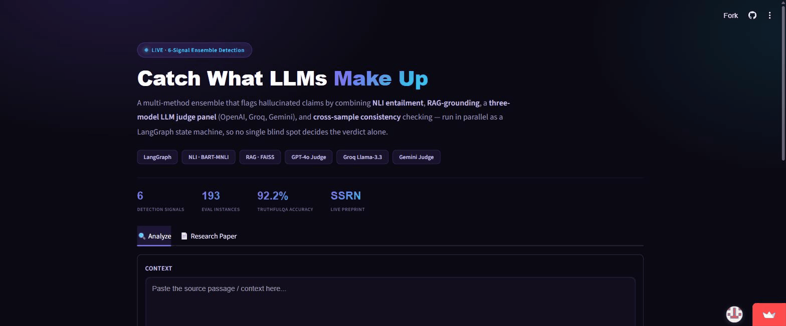
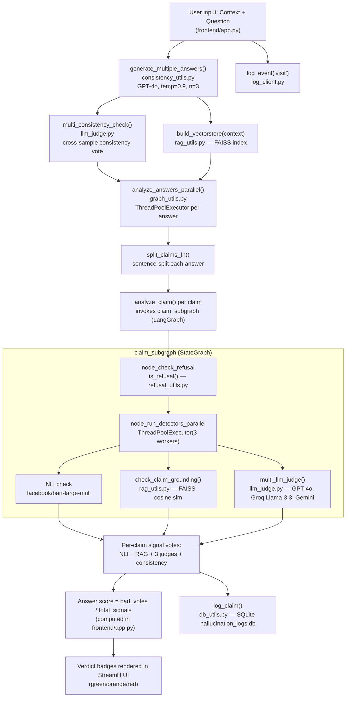

# Hallucination Detector

A hallucination detection and evaluation system for LLM outputs, with an evaluation harness across HaluEval, TruthfulQA, and a hand-labeled dataset, plus ablation studies and confidence-interval analysis.

**Live app:** https://hallucinationdetecto.streamlit.app/

## Demo


## Stack
- Streamlit (frontend)
- LangChain (OpenAI, Groq, Google Generative AI backends)
- FAISS-based retrieval for consistency checking
- SQLite (logging)

## Architecture



## Evaluation
- `evaluate_halueval.py`, `evaluate_truthfulqa.py`, `evaluate_handlabeled.py` — benchmark evaluation runs
- `evaluate_ablation.py` / `analyze_results.py` — ablation studies
- `calculate_confidence_intervals.py` — statistical confidence intervals on results

## Run locally
```bash
pip install -r requirements.txt
streamlit run frontend/app.py
```
